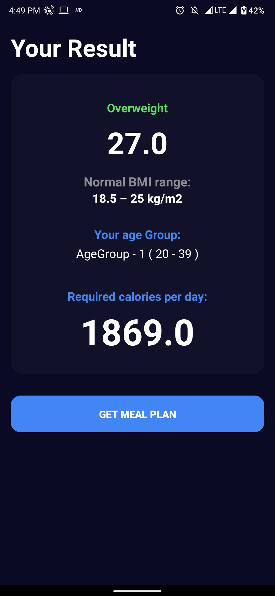

Project Description:
1. This application takes 5 inputs - age, gender, height, weight and activity level of an individual.
2. Based on above paramaters it makes two calculations - 
     a) BMI (output - personality level) 
     b) BMR (output - required calories per day)   
3. After that based on BMR calorie level the diet plan is suggested to the person. 
4. The user can also get the veg and non veg diet plan separately. 

Guidelines:
1. In the projectDietPlan folder you can find the source code written in python and php 
   a) python code - dietplanx.py
   b) php code -  index.php
2. If you want to your android application to make https request/response from your xampp localhost then    
   a) Add the projectDietPlan folder into xampp/htdocs/
   b) Change the global variable "BASE_URL" value from 'https://webdietplan.000webhostapp.com/index.php/' 
      to 'http://localhost/projectDietPlan/index.php'

Application Screens Images:

